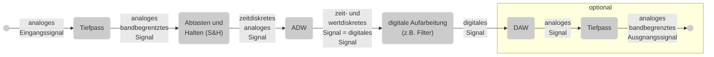
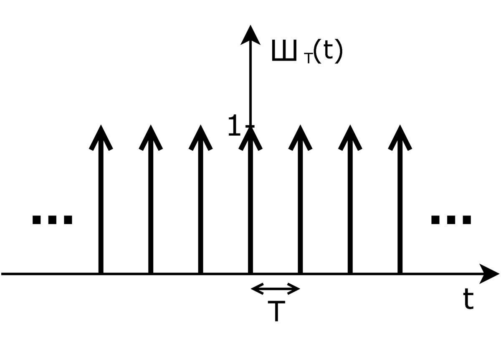
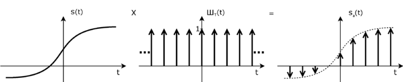
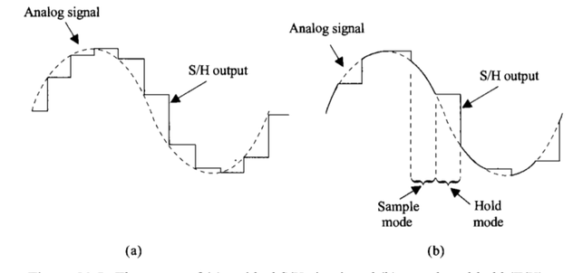
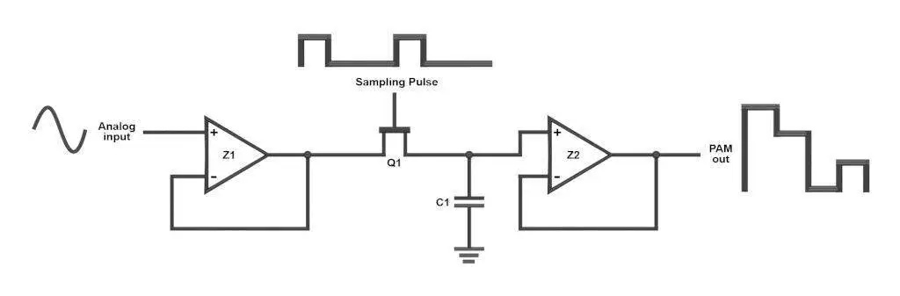

# Motivation
Analoge Signale werden zur Verarbeitung in digitlen Systemen zuerst abgetastet (zeitdiskret) und anschließend digitalisiert (wertdiskret). Wie im analogen Bereich können diese Signale auch in digitalen Systemen gefiltert / verarbeitet werden. Das Ergebnis kann am Ende wieder in ein Analogsignal zurück gewandelt oder mittels Software weiterverwendet werden.

Im analogen Bereich stehen zur Verarbeitung von Signalen Tools wie Fourier oder Laplace zur Verfügung.
Im digitalen Bereich gibt es entsprechede Tools, die allerdings systembedingt erwas komplizierter sind.

Aufgabe dieses und des nächten Semesters is es, einen Überblick über die Systematik der Signalverarbeitung zu geben.

# WH: analoge Signalverarbeitung
Grundsignal: $u(t) = \hat U * \sin(\omega_s * t + \phi) = \hat U * \sin(2 * \pi * f_s * t + \phi)$

**<or>Periodische SIgnale</or>** werden mit Hilfe der Fourier-Reihe in den Frequenzbereich transformietr.

 

$$
u(t) = \sum_{ n=-\infty }^{ \infty } U_n * e^{ j n \omega t } \newline
\ \newline
U_n = \frac 1 T \intop^{ T } u(t) * e^{ -j n \omega t }, \; wobei \; \omega = 2 \pi * f = { 2 \pi \over T }
$$

 

Hieraus ergeben sich die in Tabellen zusammengefassten Koeffizenten der periodischen Grundsignale wie Rechteck, Dreieck , Sägezahn.

# Prinzip der digitalen Signalverarbeitung
Um ein analoges Signal digital aufzunehmen, zu verarbeiten und anschließend wieder ein analoges Signal zu wandeln, sind mehrere Schritte nötig.

 

 

Ein digitales Signal untercheidet sich von einem analogen durch zwei Wesentliche Eigenschaften:
* Zeitdiskret: das Signal ist nur zu besteimmten Zeitpunkten gültig
* Wertdiskret: das Signal hat nur bestimmte Werte

Letzendlich ist ein digitales Signal eine Zahlenreihe.

# LTI-Systeme
## Definition
Wie auch im analogen Bereich beschränken wir uns bei der Betrachtung digitaler Systeme immer auf lineare, zeitinvariante Systeme (LTI).

 

Ihre Antwort auf ein Eingangssignal ist
* linear:

	$u_{ out1 }(t) = f(u_{ in1 }(t))$
$u_{ out2 }(t) = f(u_{ in2 }(t))$
$\implies u_{ out1 }(t) + u_{ out2 }(t) = f(u_{ in1 }(t) + u_{ in2 }(t))$

 

* unabhängig vom Zeitpunkt:

    $u_{ out }(t) = f(u_{ in }(t))$
$u_{ out }(t + \tau ) = f(u_{ in }(t + \tau))$

 

Somit sind alle Systeme, die
* Nichtlinearitäten (z.B. Dioden) etc. besitzen
* an Versorgungsspannungsgrenzen anstoßen
* vom Ausführungszeitpunkt abhängen (z.B. R=R(t))
nicht erfassen

 

Genau genommen macht gerade der letzte Punkt Schwierigkeiten.
Zeitinvariante Systeme gibt es eigentlich nur in der Theorie, da sich etwa Bauteilwerte über die Zeit (Alterung, Temperatur, Druck, etc.) verändern. Zeitinvariant heißt demzufolge "innerhalb des beobachteten Zeitraumes gleichbleibend".

# Der Dirac-Impuls
## Definition
Für den weiteren Verlauf der Betrachtung ist der Dirac-Impuls nötig. Er entsteht, wenn man einen rechteckfürmigen Impuls mit der Fläche 1 immer schmöler und dementsprechend immer höher macht. Der Dirac-Impuls $\delta(t)$ ist zum Zeitpunkt $t=0$ unendlich schmal und dafür unendlich hoch - seine Fläche beträgt abe immer noch 1.

## Eigenschaft der Ausblendung
Der Dirac-impuls hat die Eigenschaft der Ausblendung. Man kann mit ihm ein Signal zu einem bestimmten Zeitpunkt einblenden alle anderen Signalwerte auf 0 setzen (ausblenden).

$$
u(t) = \intop_{ \tau = -\infty }^{ \infty } u(\tau) * \delta(t - \tau) \; d\tau = u(t) * \intop_{ \tau = -\infty }^{ \infty } \delta (t-\tau) \; d\tau
$$

Um den Signalwert $u(t)$ zu erhalten, muss man das gesamte Signal mit dem Dirac-Impuls zum Zeitpunkt $t$ multiplizieren.

## Zeit- und Frequenzbereich
Das Spektrum einer Folge von Dirac-Impulsen im Zeitbereich ist im Frequenzbereich wiederrum eine olge von Dirac-Impulsen.

Zeitbereich: Dirac-Impulse zu $t = n * T_a$ somit $s(t) = \sum_{ n=-\infty }^{ \infty } \delta(t - nT_a)$

Frequenzbereich: Dirac-Impulse zu $f = n*f_a$ somit $S(f) = \sum_{ n = -\infty }^{ \infty } \delta(f - nf_a)$

# Ideale Abtastung
## Abgetastetes Signal
An dieser Stelle mache es Sinn, die Abtastfunktion zu definieren. Diese besteht aus der zuvor beschriebenen Summe von Dirac-Impulsen

$$
a(t) = \sum_{ n=-\infty }^{ \infty } \delta(t-nT_a)
$$

Das abzutastende Signal $u(t)$ wird nun einfach mit der Abtastfunktion $a(t)$ multipliziert und ergibt $u_a(t)$.

$$
u_a(t) = u(t) * a(t) = u(t) * \sum_{ n=-\infty }^{ \infty } \delta(t-nT_a) = \sum_{ n = -\infty }^{ \infty } u(nT_a) * \delta(t-nT_a)
$$

 

#### Beispiel einer idealen Abtastung

 

## Die Faltung
Für die weiteren Betrachtungen ist es nötig, den BEgriff der FAltung anwenden zu können.

Ausgangspunkt:

$$
y(t) = \intop_{ \tau = -\infty }^{ \infty } x_1 (\tau) \circ x_2 (t - \tau) dx
$$

 

Diese Summe wird als Faltung bezeichnent und mit * dargestellt.

$$
y(t) = \intop_{ \tau = -\infty }^{ \infty } x_1(\tau) \circ x_2(t - \tau) dx = x_1(t) * x_2(t)
$$

 

Dabei gelten folgene Gesetze:
* $\text { kommutativ: } x(t)*y(t) = y(t)*x(t)$
* $\text { assotiativ: } x(t) * [y(t) * z(t)] = [x(t) * y(t)] * z(t)$
* $\text { distributiv: } x(t) * [y(t) + z(t)] = x(t) * y(t) + x(t) * z(t)$

  

Zum Einsatz kommt die Faltung immer dann, wenn man vom Frequenz- in den Zeitbereich bzw. umgekehrt transformieren möchte:

Es gilt:
* Faltung im Zeitbereich $\implies$ Multiplikation im Frequenzbereich
$$
u_a(t) = u(t) * \delta(t) \implies U_a(f) = U(f) \circ \delta(f)
$$

 

* Faltung im Frequenzbereich $\implies$ Multiplikation im Zeitbreich
$$
U_a(f) = U(f) * \delta(f) \implies u_a(t) = u(t) \circ \delta(t)
$$

 

  

## Frequenzspektrum
Das abgetastete Signal wird durch die Multiplikation der Abtastfunktion mit dem abzutastenden Signal beschrieben
$$
u_a(t) = u(t) \circ a(t)
$$

 

Das Spektrum eines ideal abgetasteten Signales wird somit aus 2 Spektren abgeleitet:
* dem Spektrum der Abtastfunktion (unendliche Reihe von $\delta$-Impulsen)
* dem Spektrum des abzutastenden Signales

 

Beide Spektren werden, da es sich um eine Multiplikation im Zeitbereich handelt, gefaltet.
$$
u_a(t) = u(t) \circ a(t) \implies U_a(f) = U(f) * A(f)
$$

 

Beim Falten der beiden Spektren zeigt sich, dass sich das Spektum des abzutastenden Signales um das Spektrum der Abtastfunktion "faltet", also periodisch wiederholt.

# Reale Abtastung
### Sample & Hold
Bei der idealen Abtatung nutzt man Dirac-Impulse, um den Signalwert zu ermitteln. In der Realität braucht man Zeit, um das abgetastete Signalmit Hilfe eines ADCs auszuwerten und dem digitalen Rechner zur Verfügung zu Stellen.
Dies geschiet, in dem das Signal mit einer Sample & Hold Schaltung kurzzeitig auf seinem Wert zum Abtastzeitpunkt gehalten wird.

 

Elektronisch wird S&H mit Hilfe eines getakteten Schalters und eines Kondensators realisiert.

Derartige Schaltungen gibt es als IC (z.B: **LF198**) oder beim PSoC als Komponente.

Dimensionierung von C:
C widr über den Einganswiderstand des ADC entladen. Er muss daher so groß sein, dass während der Wandlung der gespeicherte Wert um weniger als 1LSB ändert.
z.B: 5V mit 8Bit $\implies$ 1LSB = 19.5mV. Bei einer Wandeldauer von 100µs und einem Innenwiderstand ADC von 1M$\Omega \implies C=25nF$ 

## Abtastfenster
Im digitalen Bereich betrachtet man immer eine bestimmte Anzahl von Abtastungen. Dies entspriht einem Fenster, welches man über das analoge Signal legt. Innerhalb des Betrachtungsfensters hat das Signal sienen <or>"normalen Wert"</or>, außerhalb ist es 0 - nur die Abtastwerte des analogen Signales, die in diesem FEnster liegen, werden später verwendet.

## Zeit <-> Frequenzbereich
Das abzutastende Signal ist also das Produkt aus dem Eingangssignal mjlitplizert mit dem Fenstersignal. Für die Abtastung wird dieses Produkt noch mit der Abtastfunktion a(t), also der unendlichen Summe der Dirac-Impulse multiplizert.
$$
u_a(t) = u(t) \circ a(t) \circ Fenster(t) \overbrace { \implies }^{ Fourier }  U_a(f) = U(f) * A(f) * Fenster(f)
$$

 

Es werden somit 3 Spektren gefaltet:
1) u(t): betrachtet man nur ein Sinussignal mit einer Frequenz ergibt sich eine Spektrallinie bei $\pm$ fs
2) a(t): Spektrum mit Linien bei $\pm$ fs
3) Fenster(t): sinc-förmiges Spektrum mit $f= { 1 \over Fensterbreite }$

 

Es gilt: $f << fs < { fa \over 2 }$
$\implies$ Siehe Excel Simulation der Faltung mit 3 Signalen

### Beispiel
Abtastfenster: <date>1s breit</date>
Einganssignal: <date>10Hz</date>
Abtastfrequenz: <date>100Hz</date>

[Fenster](https://www.lntwww.de/Signaldarstellung/Spektralanalyse)

# Abtasttheorem
## Definition
Das Abtasttheorem beantwortet die Frage, in welchem zeitlichen Abstand einem Signal Proben entnommen werden müssen, um es aus denselben ohne Informationsverlust wieder vollständig rekonstruieren zu können.

Das Abtasttheorem wurde von Shanon auf Basis von Arbeiten unter anderem von Nyquist entwickelt und sagt aus, dass die Abtastfrequenz größer als die doppelte maximal im abzutastenden Signal vorkommende Frequenz ein muss.

$$
\LARGE f_a > 2 \circ f_{ max }
$$

 

Betrachten wir das Spektrum des abgetasteten Signals ergibt sich dieses Kriterium automatisch, um das Eingangssignal nicht durch "falsche" Frequenzanteile zu verfälschen.

Somit ist auch der Eingangstiefpass in der Prinzipschaltung am Kapitelbeginn erklärt. Er sorgt dafür, dass das Abtasttheorem eingehalten wird.

# Reale Abtastung
## Sample & Hold
Bei der idealen Abtastung nutzt man Dirac-Impulse, um den Signalwert zu ermitteln. In der Realität braucht man Zeit, um das abgetastete Signal mit Hilfe eines ADCs auszuwerten und dem digitalen Rechner zur Verfügung zu stellen.
Dies geschiet, in dem das Signal mittels einer Sample & Hold Schaltung kurzzeitig auf seinem Wert zum Abtastzeitpunkt gehalten wird.

Elektronisch wird S&H mit Hilfe eines getakteten Schalters und eines Kondensators realisiert.

Derartige Schaltungen gibts als IC (z.B. LF198) oder beim PSoC als Komponente.

Dimensionierung von C:
C Wird über den Eingangswiderstand des ADC entladen. Er muss daher so groß sein, dass während der Dauer der Wandlung der gespeicherte Wert sich um weniger als 1LSB ändert.
z.B: 5V mit 8 Bit $\implies$ 1LSB = 19.5mV. Bei einer Wandeldauer von 100µs und einem Innenwiderstand des ADC von 1M$\Omega \implies$ C=25nF

## Abtastfenster
Im digitalen Bereich betrachtet man immer eine bestimmte Anzahl von Abtastungen. Dies entspricht einem Fenster, welches man über das analoge Signal legt. Innerhalb des Baetrachtungsfensters hat das Signal seinen "normalen Wert", außerhalb ist es 0 - nur die Abtastwerte des analogen Signales, die in diesem Fenster liegen, werden später verwendet.

## Frequenzspektrum
Beim Falten der beiden Spektren zeigt sich, dass sich das Spektrum des abzutastenden Signales um das Spektrum der Abtastfunktion "faltet", also periodisch wiederholt.

# Abtasttheorem
## Definition
Das Abtasttheorem beantwortet die Frage, in welchem zeitlichen Abstand einem Signal Proben entnommen werden müssen, um es aus denselben ohne Informationsverlust wieder vollständig rekonstruieren zu können.

 

Das Abtasttheorem wurde von Shanon auf Basis von Arbeiten unter anderem von Nyquist entwickelt und sagt aus, dass die Abtastfrequenz größer als die doppelte maximal im abzutastenden Signal vorkommende Frequenz sein muss.
$$
\Large f_a > f \circ f_{ max }
$$

Betrachten wir das Spektrum des abgetasteten Signals ergibt sich dieses Kriterium automatisch, um das Eingangssignal nicht durch "falsche" Frequenzanteile zu verfälschen.

Somit ist auch der Eingangstiefpass in der Prinzipschaltung am Kapitelbeginn erklärt. Er sorgt dafür, dass das Abtasttheorem eingehalten wird.

## Aliasfrequenz
Wird das Abtasttheorem nicht eingehalten, entstehen sogenannte Alias-Frequezen. Diese können etwa bei unserem Oszilloskopen im Labor beobachtet werden - oder bei den Kutschenrädern im alten Westen.

Berechnung der Alias-Frequenz:
Sei $f_a = 1kHz$, so muss nach Shannon die maximale Signalfrequenz kleiner als 500Hz sein. Ist sie es nicht, ergeben sich Aliasfrequenzen nach folgendem Schema:
$$
f_{ Alias } = \left | n \circ f_a \pm f \right | \text { mit } n = 1,2,3,...
$$
Würde ein 600Hz-Signal abgetastet werden, ergeben sich
Aliasfrequenzen mit $1kHz\pm600Hz$, $2kHz\pm600Hz$, usw.

# Digitale Filter
Nachdem das S&H-Signal vom ADC konvertiert wurde, steht es als digitaler Wert dem µC zur Verfügung. Dieser kann es nun mit beliebigen Algorithmen bearbeiten.

Zum Beispiel:
$$
y = \sum_{ n=0 }^{ k } \text { Faktor }_n \circ \text { Abtastwert }_n = a_0 \circ x_0 + a_1 \circ x_1 + a_2 \circ x_2 + ...
$$

Der Wert von y kannĕispielweise wieder mittels eines DAC in ein analoges Signal gewandelt und ausgegeben werden. Wie wir in den letzten Kapiteln gesehen haben, ist allerdings das Spektrum des so erzeugten analogen Ausgangssignales unendlich. Es muss daher auf jeden Fall mit Hilfe eines analogen Tiefpasses auf den Frequenzbereich des Eingangssignales begrenzt werden $\left (f_g < { f_a \over 2 } \right )$

Wie im analogen Bereich gibt es digitale Filter mit TP, HP, BP und BS Verhalten. Es kännen allerdings auch im Analogen nicht realisierbare Filter erzeugt werden.

## eine einfache Annäherung
BBetrachen wir einen nalogen Tiefpass. Ein Dirac-Impuls am Eingang führt zu einer entsprechenden Impuls-Antwort am Ausgang.
Uns interessieren nur die Werte der Impuls-Antwort zu den Zeitpunkten nxT~a~.

| n   | U(nxTs) |
| --- | ------- |
| 0   | 1.000   |
| 1   | 0.368   |
| 2   | 0.135   |
| 3   | 0.050   |
| 4   | 0.018   |

Um das Ausgangssignal zu berechnen, welches ja aus der Summe der gewichteten Eingangssignale besteht, ist noch die Anzahl der Summanden fest zu legen. In diesem Fall sind es 5.

$$
U_{ out } (n) = 1 \circ U_{ in }(n) + 0.37 \circ U_{ in }(n-1) + 0.14 \circ U_{ in }(n-2) + 0.05 \circ U_{ in }(n-3) + 0.02 \circ U_{ in }(n-4)
$$
