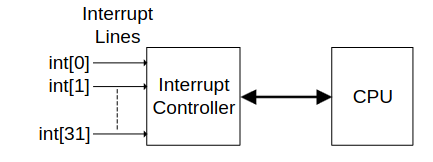
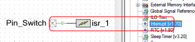
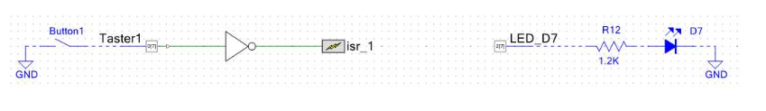

<style>
	body {
		font-size: 1.65vw;
		background: white;
		color: black;
	}
	date {
		color: gray;
		font-size: 1.3vw;
	}
	h1 {
		margin-top: 10vw;
		font-size: 5vw;
	}
	h2 {
		margin-top: 8vw;
		font-size: 4vw;
	}
	h3 {
		margin-top: 6.6vw;
	 	font-size: 3.3vw;
	}
	h4 {
		margin-top: 5vw;
		font-size: 2.5vw;
	}
	.merke {
		background-color: rgba(150, 0, 0, 100);
		border-radius: 2.2vw;
		border: .4vw solid red;
		padding: 2.2vw;
		margin: 1.1vw;
		color: white;
	}
	.infobox {
		background-color: rgba(20, 100, 150, 100);
		border-radius: 2.2vw;
		padding: 2.2vw;
		margin: 1.1vw;
		color: white;
		
		transition: all .3s cubic-bezier(0, 1.3, .8, 1.3);
	}
	.infobox:hover {
		background-color: rgba(30, 120, 180, 100);
	}
	.infobox:active {
		transform: scale(1.1, 1.1);
	}
	re {
		color: red;
	}
	or {
		color: orange;
	}
	strong {
		color: #05f01c;
	}
	.wimage {
		justify-content: center;
		background: white;
		align-items: center;
		padding: 1.1vw;

		display: flex;
	}
	.wimagetext {
		flex: 3;
		margin-left: 2.2vw;
		color: black;
	}
	.wimageimage {
		flex: 2;
	}
	.wimageimage:hover {
		flex: 3;
	}
</style>

# Interrupts (PSoC 3 & 5LP)


## In PSoC Creator


#### Configuration
InterruptType can be either
* DERIVED
* RISING_EDGE
* LEVEL

### Skriptum Kupfner
Interrupts: S11
Supports 32 Interrupt signals with 8 Priorities (0 (highest) to 7 (lowest)) which can be changed dynamically.
When a higher priority interrupt occurs, the currently running interrupt is interrupted (as if it was a normal program).

#### Traps vs Interrupts
* Interrupt: Asynchron
* Trap: Synchron

#### Level vs Pulse Interrupts
Level has to be cleared by firmware, Pulse is executed on rising edge

#### Beispiel

example code
```c
#include "project.h"

CY_ISR(Taster1_ISR) {
  LED_D7_Write(1);
  CyDelay(500);
  LED_D7_Write(0);
  CyDelay(100);
}

int main(void) {
  isr_1_StartEx(Taster1_ISR);
  isr_1_ClearPending();
  CyGlobalIntEnable; /* Enable global interrupts. */

  /* Place your initialization/startup code here (e.g. MyInst_Start()) */
  
  for(;;)
  {
  /* Place your application code here. */
  }
}
```

in this case, `CY_ISR` is a macro for interrupt-definitions. The name (in this case **Taster1_ISR**) can be chosen freely, but must be tha same in the macro and the `StartEx` function.

`ClearPending();` resets clears all interrupt flags, `CyGlobalIntEnble;` enables all global interrupts.

<br>

##### Using Falling_Edge
When interrupting on falling_edge instead of risint_edge, the flag needs to be reset manually. If it is not reset, the interrupt function will becall over and over until it is reset.
To reset the Flag, `Taster1_ClearInterrupt();` needs to be called from within the interrupt function.

<br>

##### Interrupt priority
To change the interrupt priority in the **GUI**, go to *Design Wide Resources $\rightarrow$ Interrupts*.
To change the interrupt priority in **code**, call `<interrupt name>_SetPriority(<priority>);`.
The currently set priority can be read with `<interrupt_name>_GetPriority()`.

<br>

##### Enable / Disable
Interrupts can be enabled / disabled using 
* `<interrupt_name>_Enable();`
* `<interrupt_name>_Disable();`

#### Interrupt functions for c
|Name|Description|
|-|-|
|CY_ISR(\<interrupt_name>)|Macro for interrupt-function-definition|
|<interrupt_name>_StartEx(\<interrupt_name>)|starts the interrupt|
|<interrupt_name>_ClearPending()|clears set interrupt flags|
|...||

<br>

# Beispiel
Not-aus Industrieanlage (LED als Motor)

```c
/*
main.c

18.10.2023

Author:
Nilusink
*/
#include "project.h"
#include "stdbool.h"

bool e_stop = false;


void all_off()
{
    LED1_Write(0);
    LED2_Write(0);
    LED3_Write(0);
    LED5_Write(0);
    LED6_Write(0);
    LED7_Write(0);
}


CY_ISR(EStop) {
    isr_1_ClearPending();
    
	e_stop = true;
    
    all_off();
    
    ESTOP_LED_Write(1);
}

int main(void) {
    isr_1_StartEx(EStop);
    isr_1_ClearPending();
    CyGlobalIntEnable; /* Enable global interrupts. */
  
    ESTOP_LED_Write(0);  // make sure that the E-Stop light is off
  
    int i = 0;
    for(;;)
    {
	    // motor is doing something continually
	    // (in this case, just blink)
        all_off();

        if (!e_stop)  // check for emergency stop
    	{
            // turn on leds in a circle-animation
            switch (i % 6)
            {
                case 0:
                    LED1_Write(1);
                    break;
                case 1:
                    LED2_Write(1);
                    break;
                case 2:
                    LED3_Write(1);
                    break;
                case 3:
                    LED5_Write(1);
                    break;
                case 4:
                    LED6_Write(1);
                    break;
                case 5:
                    LED7_Write(1);
                    break;
            }
    	}
        else
        {
            // if emergency-stop is pressed, blink the center led   
            if (i % 5 == 0)
            {
                ESTOP_LED_Write(1);
            }
            else
            {
                ESTOP_LED_Write(0);
            }
        }
    	CyDelay(50);
        i++;
	}
}
```

### Quellen
[PSoC Interrupts](https://www.infineon.com/dgdl/Infineon-AN54460_PSoC_3_and_PSoC_5LP_Interrupts-ApplicationNotes-v12_00-EN.pdf?fileId=8ac78c8c7cdc391c017d0724dcc3498e)
