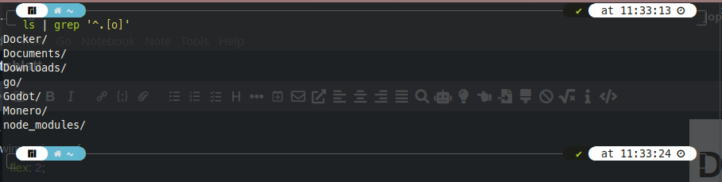

<style>
	body {
		font-size: 1.65vw;
		background: white;
		color: black;
	}
	date {
		color: gray;
		font-size: 1.3vw;
	}
	h1 {
		margin-top: 10vw;
		font-size: 5vw;
	}
	h2 {
		margin-top: 8vw;
		font-size: 4vw;
	}
	h3 {
		margin-top: 6.6vw;
	 	font-size: 3.3vw;
	}
	h4 {
		margin-top: 5vw;
		font-size: 2.5vw;
	}
	.merke {
		background-color: rgba(150, 0, 0, 100);
		border-radius: 2.2vw;
		border: .4vw solid red;
		padding: 2.2vw;
		margin: 1.1vw;
		color: white;
	}
	.infobox {
		background-color: rgba(20, 100, 150, 100);
		border-radius: 2.2vw;
		padding: 2.2vw;
		margin: 1.1vw;
		color: white;
		
		transition: all .3s cubic-bezier(0, 1.3, .8, 1.3);
		
		user-select: none;
	}
	.infobox:hover {
		background-color: rgba(30, 120, 180, 100);
	}
	.infobox:active {
		transform: scale(1.1, 1.1);
	}
	re {
		color: red;
	}
	or {
		color: orange;
	}
	strong {
		color: #05f01c;
	}
	.wimage {
		justify-content: center;
		background: white;
		align-items: center;
		padding: 1.1vw;

	}
	.wimagetext {
		flex: 3;
		margin-left: 2.2vw;
		color: black;
	}
	.wimagetext:hover {
		flex: 5;
	}
	.wimageimage {
		flex: 2;
	}
	.wimageimage:hover {
		flex: 3;
	}
	tr {
		background: #333;
	}
    mark {
		border-radius: 5px;
    	padding: 2px;
    }
</style>
# Dateioperationen
### Ins Homeverzeichnis wechseln


### Alle Dateien an deren 2ter stelle ein "o" liegt

Einen ordner ersetllen und in in hinein wechseln

oder (mittels hilfs-function):


### 2: Eingabe / Ausgabe

### 3: Hilfe
```bash
man chmod
```

``` bash
man groups
```

Befehle
* cat

### C-Programme
```
nvim add.c
```

Berechtigungen wurden nicht geändert, da eine .c Datei auf **keinen** Fall execute-Berechtigungen besitzen sollte.


### Berechtigungen und Benutzergruppen


### Updates


#### Was ist busybox?
Busybox ist eine Ansammlung an tools, die Original für Linux entwickelt wurde.

<br>

### Prozesse beenden
```bash
# sofort  (SIGKILL)
sudo kill -s 9 2333

# mit aufräumarbeiten  (SIGINT)
sudo kill -s 15 2333
```

#### Reboot in 2 minuten
```
sudo shutdown -r 2

```

<br>

### Netzwerkverbindungen
#### Informationen Anzeigen


#### Trennen / Herstellen der verbindung


### Archivieren und komprimieren


Das Verzeichnis enthält nicht die Ursrüngliche Dateien, da diese noch in einem TAR-Archiev gespeichert sind.
