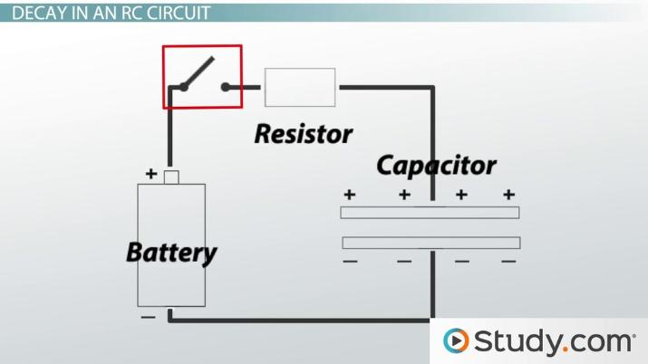

## Maschenregel
$$
\Large -U_0 + R \circ i + \underbrace { U_c }_{ U_C = { q \over C } }
$$
$$
-U_0 + R \circ C \circ U_C'(t) + U_C(t) = 0 \text { und } U_C(t) \newline
\ \newline
\text {Näherung } U_C' \approx { \Delta U_C \over \Delta t } \approx { U_{ C_{ n+1 } } - U_{ C_n }  \over \Delta t }
$$

## Beispiel
$$
U_0 = 5 \newline
\Delta t  =0.1 \newline
RC = 1
$$
ggb $\implies$ Tabelle

### Radioaktiver Zerfall
$$
{ dN_{ (t) } \over dt } = c * N_{ (t) }
$$
homogene lineare Differentialgleichung 1. Ordnung (max erste Ableitung) (mit konstanten Koeffizienten)

Fall:
$$
m * { d^2 \over dt^2 } = m * g - k * \left ( { ds \over dt } \right )^2
$$
***
 

  
Dgl - Differentialgleichung

 

Die Lösung von Differentialgleichung hängt von der Art der Differentialgleichung ab, daher gibt es einige Begriffe zur Klssifizierung
* homogen
  * es sind Summanden enthalten, die die gesuchte Funktion enthalten
* inhomogen
	* es gibt zusätzlich ein Störglied (= Teil, der die gesuchte Funktion NICHT enthält)
* Ordnung der Differentialgleichung
  * höchste vorkommende Ableitung
* linear | nichtlinear
* mit Konstanten / variablen Koeffizienten

# 1. Ordnung
Viele Differentialgleichungen lassen sich mit Hilfe von Seperation (= "Trennung der Variablen") lösen (**alle** ) homogenen und manche inhomogene

z.B: $y' = \frac x y$
Sep: 
$$
{ dy \over dx } = \frac y x \newline
\ \newline
\int { 1 \over y } * dy = \int { 1 \over x } * dx \newline
\ \newline
\ln(|y|) = \ln(|x|) + c \newline
\ \newline
|y| = e^{ \ln(|x|)} + c = e^c * e^{ \ln(|x|)} = \widetilde c * |x|
$$

## Allgemeine Lösung
$y = \underbrace c_ { \text { offene Konstante } } * x \text { (für } x \ge 0)$

falls man eine Zusatzinformationen hat, z.B. dass P(3|4) auf den Graf liegen soll, ergibt sich daraus die "spezielle Lösung"
$4 = c * 3 \implies c = \frac 4 3$
$\implies y_s = \frac 4 3 * x$

### Buch S. 98
#### 4.53a
$$
y' + 6y = 0 \newline
\ \newline
{ dy \over dx } = -6y \newline
\ \newline
\frac 1 y * dy = -6 * dx \newline
\ \newline
\int \frac 1 y * dy = \int -6 * dx \newline
\ \newline
\ln (|y|) = -6x + c \newline
\ \newline
|y| = e^{ -6x + c } = e^c * e^{ -6x } \newline
\ \newline
|y| = \widetilde c * e^{ -6x }
$$

 

#### 4.57 a

Trick:
$y' = 3-0.5y$
Dividiere durch die ganze rechte seite (und *dx)

 

$$
y' + 0.5y = 3; \; y_0 = -1 \newline
\ \newline \ \newline
y' = 3 - 0.5y \newline
\ \newline
{ dy \over 3 - 0.5 y} = dx \newline
\ \newline
\int {dy \over 3 - 0.5y } = \int { 1 * dx } \newline
\ \newline
({ -1 \over 0.5})\ln(3-0.5y) = x + c
$$

HÜ: foto von lilo

### WH
$$
y' + 3y = 0 \newline \, \newline
{ dy \over dx } = -3y \newline \, \newline
\int \frac 1 y dy = \int -3 dx \newline \, \newline
\ln (|y|) = -3x + c \newline \, \newline
y = e^{ -3x + c } = \underbrace { \widetilde c }_{ > 0 } * e^{ -3x }
$$

### WH
direkt proportional: $y = k * x$
indirekt poportional: $y = c * \frac 1 x$

### Übung
BS 84
#### 4.8
Die Steigung der Tangente an eine Funktion is in jedem Punkt p(x|y)
#### a)
gleich dem Quadrat der x-Koordinate
$$
f'(x) = x^2 \newline \, \newline
f(x) = \int x^2 = { x^3 \over 3 } + C
$$

#### d)
$$
f'(x) = { 1 \over x * y}
$$

#### 4.6)
buch
#### 4.10a)
Beim freien Fall im Vakuum ist die Änderung der Geschwindigkeit v in Abhängigkeit von der Höhe h indirekt proportional zur Wurzel aus der Höhe.
$$
{ dv \over dh } = { k \over \sqrt { h } }
$$

#### 4.10b)
Wird eine Wachsschicht der Dicke d gleichmäßig erwärmt, so ist die Änderung der Dicke mit der Zeit direkt proportional zur momentanen Wachsdichte.
$$
{ dr \over dt } = k * r
$$

#### 4.10c)
Die Änderung  des Dampfdrucks p mit der Temperatur T ist für eine bestimmte Substanz direkt proportional zum Dampfdruck und indirekt proportional zum Quadrat der Temperatur.
$$
{ dp \over dT } = k * { p \over T^2 }
$$

#### Beispiel
Änderung der Anzahl von Kernen mit der Zeit ist proportional zur Anzahl.
#### a)
Dgl = ${ dN \over dt } = kN$
#### b)
allgemeine Lösung für anfangs N~0~ Kerne
$$
\int \frac 1 N dN = \int k dt \newline \, \newline
ln(N) = k * t + C \newline \, \newline
N_{ (t) } = \widetilde c * e^{ k * t } \newline \, \newline \, \newline
N_{ (0) } = N_0 = \widetilde c * 1 \implies N_{ (t) } = N_0 * e^{ k * t }
$$
#### c)
spezielle Lösung für HWZ = 5370
$$
Hwz \implies { N_0 \over 2 } = N_0 * e^{ k * 5370 } \implies k = { \ln (0.5) \over 5370 } = -0.00029
$$

### Heizungstechnik
#### a)
In einem bestimmten Zimmer steigt nach dem Einschalten der Heizung die Temperatur T an. Der Verlauf der Temperatur T kann modellhaft durch die nachstehende Differenzialgleichung beschrieben werden.
$$
{ dT \over dt } = a * (b - T) \newline \, \newline
t ... \text { Zeit nach dem Einschalten der Heizung in min } \newline
T(t) ... \text { Temperatur im Zimmer zur Zeit t in °C } \newline
a, b ... \text { Parameter }
$$
#### a1)
Geben Sie die zugehörige homogene Differenzialgleichung an. (einfach störungsglied wecklassen)
$$
{ dT \over dt } = a * b - a * T \newline \, \newline
{ dT \over dt } = -a*T
$$

#### a2)
es wurde bereits ein speziefischer Wert eingesetzt.
$$
\Large T_n = c * e^{ -{ t \over 10 } } \large \implies a = ?
$$
$$
{ dT \over dt } = -a * T \newline \, \newline
\int \frac 1 T \, dT = \int -a \, d t \newline \, \newline
\ln(T) = -a * t + c \newline \, \newline
T_n = e^{ -a * t } * \widetilde c
$$
wird dies nun mit der Aufgabenstellung verglichen, eribt sich:
$$
a = \frac 1 { 10 }
$$

#### 4.18
$$
s''(t) = a \newline \, \newline \, \newline
a = 0.5 \newline
v_0 = 1 \newline
s_0 = 2
$$

1x Integrieren
$$
s' = 0.5 * t + c = 0.5 * t + v_0
$$

2x Integrieren
$$
s = { 0.5 * t^2 \over 2} + v_0 * t + s_0 = 0.25t^2 + t + 2
$$

#### b)
$$
a = 0 \newline
v_0 = 15 \newline
s_0 = 120 \newline
$$
$$
s' = \int a \, dt = 0 + c = 15 \newline \, \newline
s = \int s' \, dt = 15 * t + 120
$$

### HÜ:
1x von S.87
1x von S.88-92

