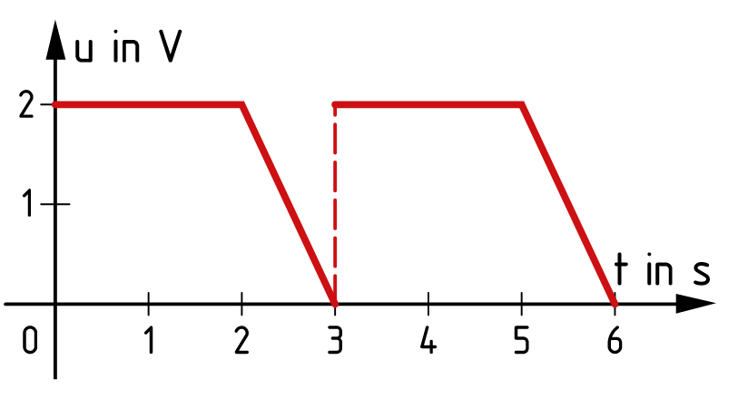
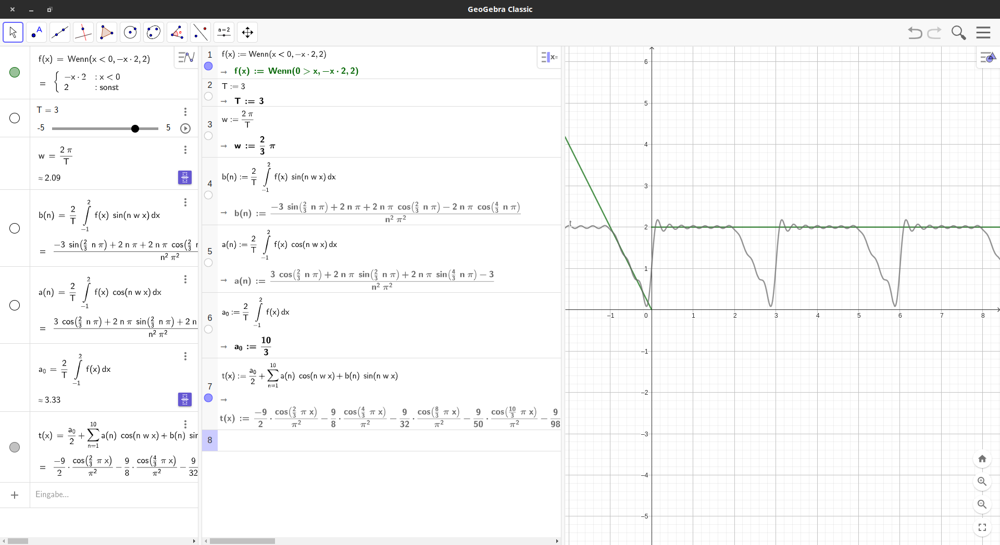
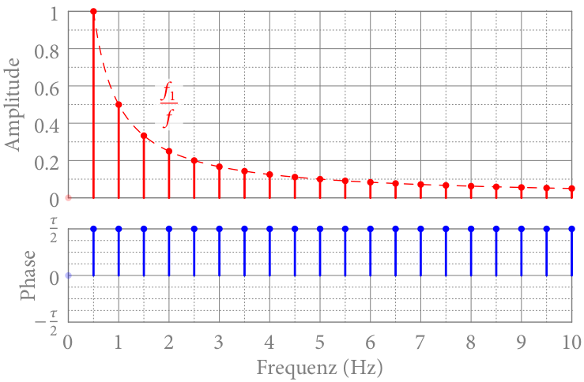
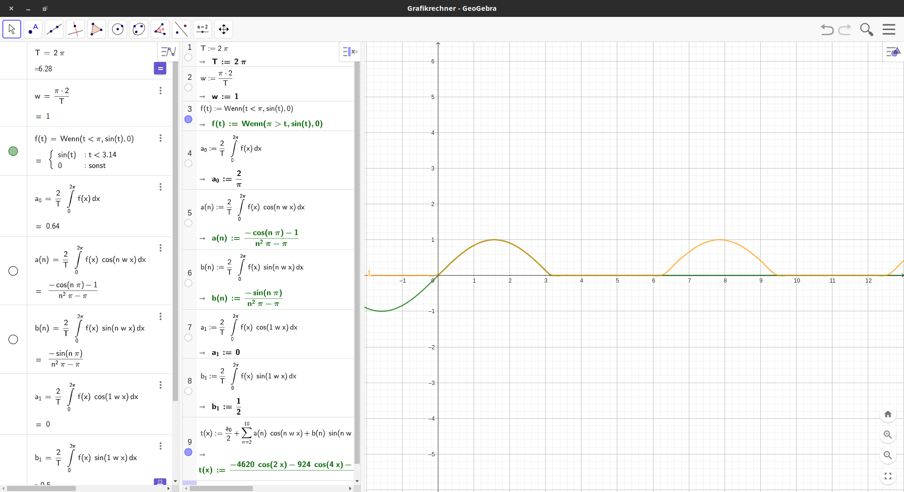

B.S. 64
$$
\Large f(t) = { a_0 \over 2 } + \sum^{ \infty }_{ n=1 } ( a_n * \cos( n \omega_0 t ) + b_n * \sin( n \omega_0 t) ) \ \bigg |_{ \Large { \omega_0 = { 2\pi \over T } } } \newline
\ \newline
a_0 = \frac 2 T * \int_{ 0 }^{ \text { periodendauer } } { f }
$$

## 3.43b
(BS. 63)

$$
T = 3\newline
\ \newline \ \newline
\text { Gerader Teil } \newline
y = 2 \newline
\ \newline \ \newline
\text { Gefälle (Periode von -1 bis 2)} \newline
y = -2 x + 0 \newline
\ \newline \ \newline
a_0 = \frac 2 T * \int_{ -1 }^{ 2 } f(x) \newline
\ \newline \ \newline
\text { Aus dem Buch: } \newline
a(n) \, := \frac 2 T * \int_{ -1 }^{ 2 } f(x) * \cos(n * w * x) \newline \ \newline
b(n) \, := \frac 2 T * \int_{ -1 }^{ 2 } f(x) * \sin(n * w * x) \newline \ \newline
t(x) \, :={ a_0 \over 2 } + \sum_{ 1 }^{ 10 } (a(n) * cos(n*w*x) + b(n) * sin(n*w*x), n, 1, 10)
$$

[Bsp. 3.43](../../_resources/27_11_2023.ggb)

Für das Ergebnis ("Spektrum") wird meist die "Amplituden-Phasen form" verwendet (Buch S. 70) = 
$$
A_0 + \sum_{ n = 1 }^{ \infty } A_n + \sin ( n * \omega_0 * t + \phi_n)
$$

##### "Amplituden- & Phasenspektrum": 

$$
\phi_n = 0 \implies \text { reiner Snus } \newline
\phi_n = \pm \frac \pi 2 \implies reiner Cosinus
$$

#### Übung
Bsp 3:
$$
f_{ (t) } ... "Einweg-Gleichrichter"
$$
* FR ?
* Spektrum

a~1~ und b~1~ mussten extra ausgerechnet werden, da geogebra keine allgemeine Formel fand, sondern nur eine die ab 2 gilt.
