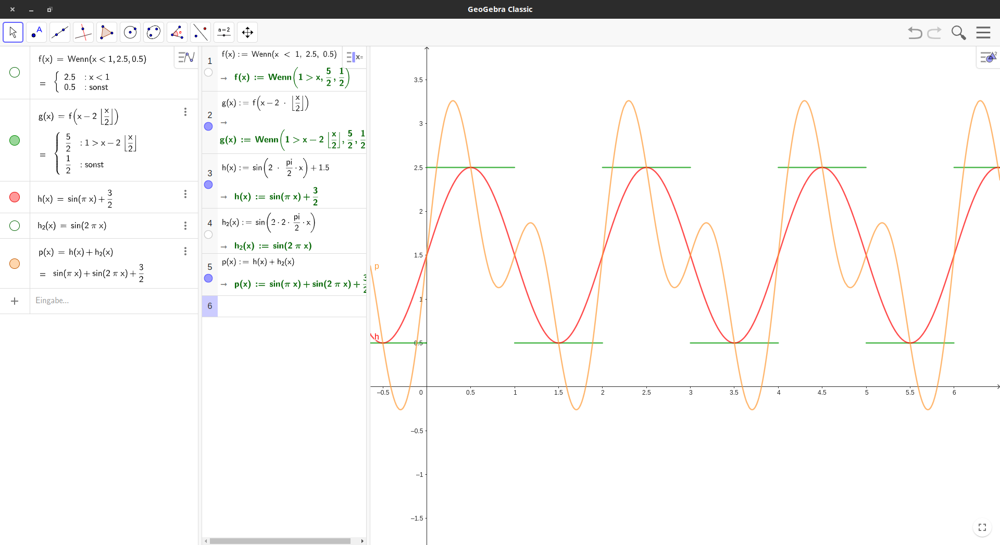

<!-- jarvis-summary-start -->
# Summary
The note discusses the concepts of distribution and density in geography. It explains that distribution refers to the way people are spread out across the surface, often shown through a dot map, while density refers to the number of people living in a certain area, usually shown through a choropleth map. The note also highlights the factors that affect distribution and density, including physical factors like relief and climate, and human factors like social and economic factors. Additionally, the note introduces the demographic transition model, which explains population growth patterns in different stages, with factors like birth rates, death rates, and societal changes playing a role.
<!-- jarvis-summary-end -->

B.S. 64
$$
\Large f(t) = { a_0 \over 2 } + \sum^{ \infty }_{ n=1 } ( a_n * \cos( n \omega_0 t ) + b_n * \sin( n \omega_0 t) ) \ \bigg |_{ \Large { \omega_0 = { 2\pi \over T } } }
$$
