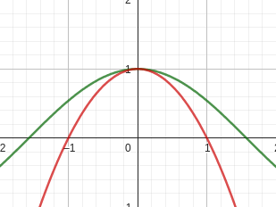
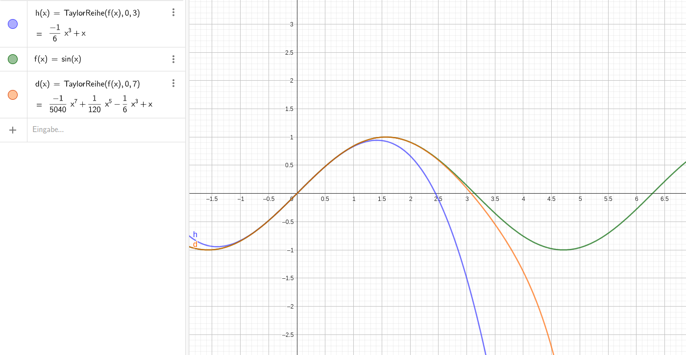
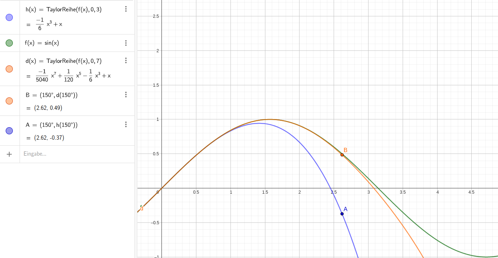
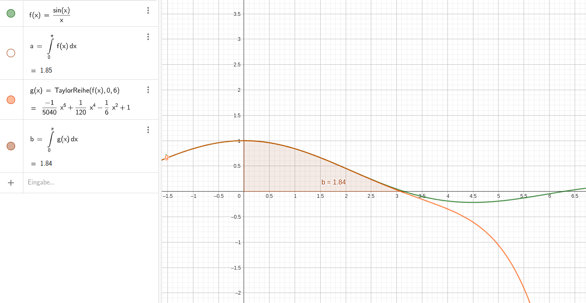

<date>18/09/2023 08:58</date>

	
	

$$f(x):=cos(x)$$
Annähern mit:
$$-x^2+1$$

  

Erste ableitung bereits gleichgesetzt, also nun 2te:
$
f''(x) = -cos(x) \newline
\ \newline
g'(x) = -2x + b \newline
g''(x) = 2a
$
also: 
$
2a = -1
$
$
-{ x^2 \over 2 } + 1
$

Oder, mit geogebra: 
$
h(x)=TaylorReihe(cos(x),0,7) \newline
\rightarrow 1 - { 1x^2 \over 2! } + { x^4 \over 4! } - { 1x^6 \over 6! }
$

# Taylorreihen
OFt werden Polynomfunktionen als Näherung für komplizuertere Ausdrücke verwendet.
Neben
* **<or>Interpolation** (z.B. eine quadratische Funktion wird durch 3 Punkte der gegebenen Kurve gelegt) und
* **<or>Regression** (z.B. "beste Gerade durch Messpunkte")

gibt es hier die Mögichkeit der "**<re>Taylorreihenentwlcklung**". Dies ist eine Erweiterung von "**<or>Linearisierung**" (d.h. Kurve wird durch Tangente ersetzt).

#### Bsp 1
Finde ein Taylorpolynom von Grad 3 für die Funktion
$$f(x) = sin(x)$$
<date>(Idee: An einer Stelle (t.B x=0 "Entwicklungspunkt") sollen Funktionswert sowie Ableitungen übereinstimmen, also y~(0)~ = t~(0)~, y'~(0)~ = t'~(0)~, ...)</date>

##### Ableitungen
$$
t(x) = t(x)=a * x^3 + b*  x^2 + c * x + d \newline
t'(x) = a * 3x^2 + b*  2x + c \newline
t''(x) = a * 6x + 2 * b \newline
t'''(x) = -6 * a \newline
\ \newline
f(x) = sin(x) \newline
f'(x) = cos(x) \newline
f''(x) = -sin(x) \newline
f'''(x) = -cos(x)
$$

##### Gleichsetzungen
$$
\ \newline \ \newline
a * x^3 + b*  x^2 + c * x + d = sin(x) = 0 \newline
a * 0^3 + b*  0^2 + c * 0 + d = 0 \newline
d = 0 \newline
\ \newline
a*3*0^2 + b*2*0 + c = cos(x) = 1 \newline
c = 1 \newline
\ \newline
a * 6x + 2 * b = -sin(x) = 0 \newline
2 * b = 0 \newline
b = 0 \newline
\ \newline
6 * a = -cos(0) = -1 \newline
a = { -cos(0) \over 6 } = -\frac 1 6
$$

##### Angepasste Formel
$$
t(x)={ 1 \over 6 } x^3+0 x^2 + 1 x + 0
$$

 

Man sieht: die Übereinstimmung ist in der Nähe des Entwicklungspunktes x~0~ = 0 gut, weit außerhalb wird das Ergebnis sinnlos! (sin(x) kann nie kleiner als -1 werden !!!)

### Allgemeines
$
\boxed {
t_{ (x) } = \sum_{ i=0 }^{ n \ \ \infty } a_i x^i
}
\text{ mit }
\boxed {
a_i = { f^{ (i) }_{ (x_0) } \over i! }
} \newline \ \newline
\text {n ... Taylorpolynom vom Grad n } \newline
\infty \text{ ... Taylorreihe}	
$

##### Bemerkung: Tabele wichtiger Taylorreihenentwicklungen Buch 4 S. 59
z.B. ${ 1 \over 1 - x } = 1 + x + x^2 + x^3 + \dots$
$\underbrace { \text { konvergenzbereich } } |x| < 1$
$\text { d.h. manche TR-Entwicklungen sind } \newline \text { nur in gewissen Bereichen konvergent } \newline \rightarrow \text { diese ist max bis zur Polstelle be } \newline \text { i x=1 verwendbar (Da Polynome keine } \newline \text { Polstellen aufweisen) }$

### Übungen (BS 60)
* 3.30 mit geogebra
* 3.36 a)

#### 3.30
1) Entwickle die Funktion f mit $f(x) = \sin(x)$ an der stelle x~0~ in eine Taylorreihe

 

2) Stelle die funktion sowie die Taylorpolynome mit 3. und 7. grad dar. Gib die geeigneten Bereiche der näherungen an.

	a) Geeigneter bereich (3ter Grad): -1.2 bis 1.2
	b) Geeigneter bereich (7ter Grad): -3, +3

 

3) berechne $\sin(150°)$ mit den polynomen
	a) 3ter Grad: -0.37
	b) 7ter Grad: 0.49
wirklicher wert: 0.5
Während der Wert der Annäherungsfunktion 7ten grades noch benützbar ist, kann der Wert der funktion mit Ableitung 3ten grades überhaupt nicht mehr verwendet werden, da dieser fast das Gegenteil des eigentlichen ergebnisses ist.

#### 3.36a)

