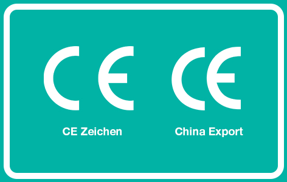

## Safety vs Security

#### Safety
Unfallvermeidung
Automatischer stop bei Kreissägen

 

#### Security
Vermeidung der Kriminalität
Sicherheitskameras.

## CE Kennzeichnung

 

* <b>Was ist eine CE Kennzeichnung?</b>
^[0]^
  * Pflicht für alle weltweit hergestellten Produkte, die in der EU verkauft werden sollen
  * vom Hersteller geprüft
  * Trifft alle EU Anforderungen an
    * Sicherheit
    * Gesundheit
    * Umweltschutz
 
  
 
* <b>Wozu dient diese Kennzeichnung? Warum ist diese Kennzeichnung so wichtig?</b>
^[0]^
  * da man so einen Hinweis darauf hat, dass dieses Produkt sicherheitlich, gesundheitlich und Umweltschutz gemäß geprüft wurde.

 

* <b>Welche "Produkte" sind mit einer CE-Kennzeichnung zu kennzeichnen? Besipiele?</b>
  * nur produkte, die jene EU-Vorschriften entsprechen, die  eine CE-Zertifizierung vorschreibt^[1]^
  * benötigt^[1]^:
    * Elektronik
    * Spielzeug
    * KFZ

  * nicht benötigt^[1]^:
    * Arzneimittel
    * Nahrungsmittel
    * Kosmetik
 
 

* <b>Welche Schritte sind für eine CE-Kennzeichnung notwendig?</b>
^[0]^
  * die Konformität mit allen EU-weiten Anforderungen sicherstellen
  * feststellen, ob Sie Ihr Produkt selbst prüfen dürfen oder ob Sie eine benannte Stelle hinzuziehen müssen
  * technische Unterlagen zusammenstellen, die die Konformität Ihres Produkts belegen.
  * eine EU-Konformitätserklärung verfassen und unterzeichnen

 

[0] ... [europa.eu](https://europa.eu/youreurope/business/product-requirements/labels-markings/ce-marking/index_de.htm)
[1] ... [instrktiv.com](https://instrktiv.com/de/ce-kennzeichnung/)
