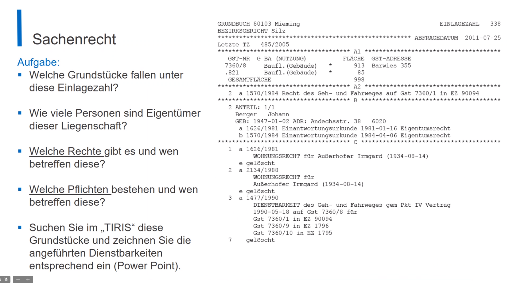

* Grundstücke
  * 7360 / 8
  * .821
* Beteiligte Personen:
  * Berger Johann (1/1)
* Rechte
  * Geh- und Fahrweg für 7360/1
* Pflichten
  * Wohnungsrecht für 
    * Außenhofer Irmgard
  * Dienstbarkeit (Geh- und Fahrweg) für:
    * 7360/1
    * 7360/9
    * 7360/10
