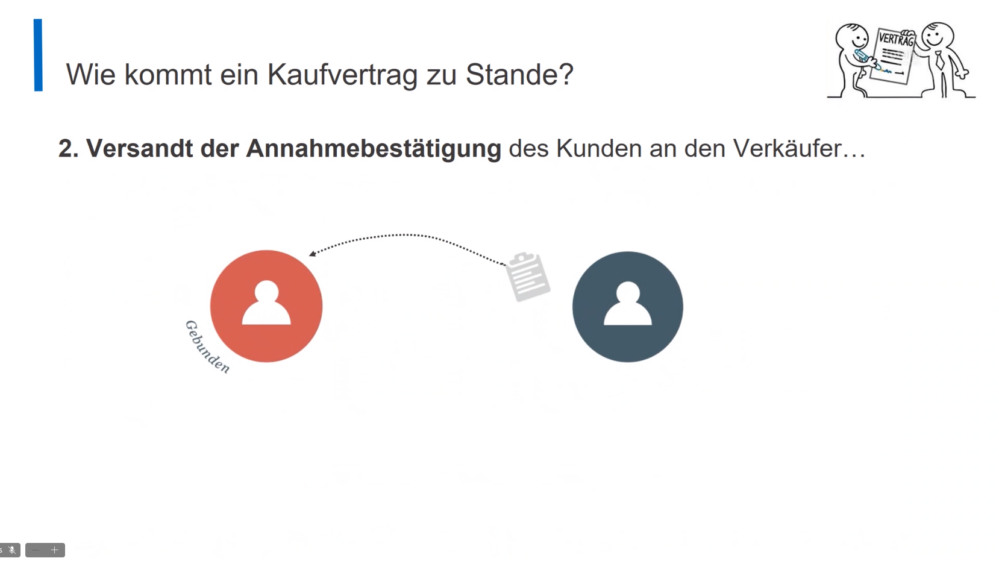
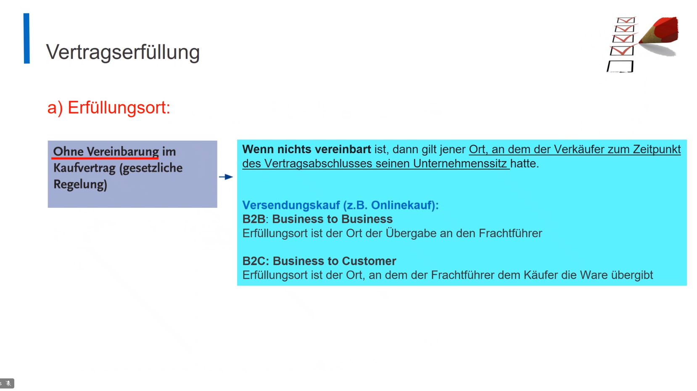

### Business & Client
B2B - Business to Business
B2C - Business to Client
C2C - Client to Client

 

  
Wekrsvertrag

  
ˈvɛrkfɛɐ̯traːk

Verlangt eine Werksleistung (i.e. Fließenleger)

 

# Bestandteile eines Kaufvertrags

